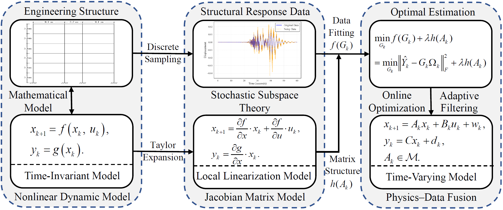
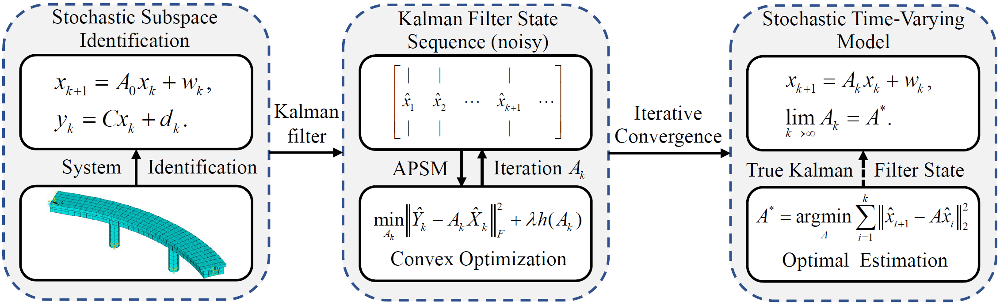
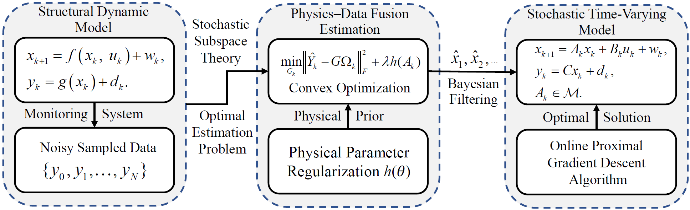

# Adaptive Physics-Informed System Modeling with Control (APSMC)

**Code and Data for the Supporting Paper**  
**Title**: *Adaptive Physics-Informed System Modeling with Control for Nonlinear Structural System Estimation*  
📌 This repository provides the official Python implementation and datasets supporting the APSMC framework proposed in our paper.  
📎 Paper: [https://doi.org/10.48550/arXiv.2505.06525](https://doi.org/10.48550/arXiv.2505.06525)  
🔗 GitHub Author Page: [https://github.com/Chen861368](https://github.com/Chen861368)

---

  

## 📄 Paper Abstract

Accurately capturing the nonlinear dynamic behavior of structures remains a significant challenge in mechanics and engineering. Traditional physics-based models 
and data-driven approaches often struggle to simultaneously ensure model interpretability, noise robustness, and estimation optimality. To address this issue, this 
paper proposes an Adaptive Physics-Informed System Modeling with Control (APSMC) framework. 
By integrating Kalman filter-based state estimation with physics-constrained 
proximal gradient optimization, the framework adaptively updates time-varying state-space model parameters while processing real-time input–output data under white noise 
disturbances. 

Theoretically, this process is equivalent to real-time tracking of the Jacobian matrix of a nonlinear dynamical system.
Within this framework, we leverage the theoretical foundation of stochastic subspace identification to demonstrate that, as observational data accumulates, the 
APSMC algorithm yields state-space model estimates that converge to the theoretically optimal solution. The effectiveness of the proposed framework is validated 
through numerical simulations of a Duffing oscillator and the seismic response of a frame structure, as well as experimental tests on a scaled bridge model. 

Experimental results show that, under noisy conditions, APSMC successfully predicts 19 consecutive 10-second time series using only a single initial 10-second 
segment for model updating, achieving a minimum normalized mean square error (NMSE) of 0.398\%. These findings demonstrate that the APSMC framework not only 
offers superior online identification and denoising performance but also provides a reliable foundation for downstream applications such as structural health 
monitoring, real-time control, adaptive filtering, and system identification.

---

## 📁 Repository Overview

This repository provides a clean Python implementation of the proposed APSMC method for both Duffing oscillators and frame structures under seismic excitation. All code and data directly support the results presented in the accompanying preprint.

  

### 📂 File Descriptions

| File Name            | Description |
|----------------------|-------------|
| `APSMC_Duffing.py`   | APSMC implementation for Duffing oscillator under harmonic excitation |
| `Duffing_system.py`  | Defines the nonlinear Duffing dynamics and simulation setup |
| `APSMC_seismic.py`   | APSMC implementation for seismic response estimation of frame structures |
| `absAccel.xlsx`      | Simulated absolute acceleration response of the frame structure |
| `ground_motion.xlsx` | Ground motion excitation data used in the seismic case |
| `load_data.npy`      | External load input (e.g., forcing function for the Duffing system) |
| `state_data.npy`     | Structural state data from the Duffing system used for validation |

---

## 📌 Highlights of the APSMC Paper

* 🧠 Proposes **Adaptive Physics-Informed System Modeling with Control (APSMC)**, a digital twin framework that fuses physics-based modeling with data-driven learning via real-time filtering and proximal gradient optimization.

* 🔁 Reformulates **nonlinear dynamics into time-varying state-space models**, enabling online updates of system matrices from sparse and noisy data.

* 📐 Theoretically proves that APSMC achieves **convergence to a physically consistent optimal solution** under the stochastic subspace identification framework with embedded Kalman filtering.

* 🧪 Demonstrates robust performance in diverse scenarios: **Duffing oscillator simulations**, **seismic response of frame structures**, and **laboratory-scaled bridge experiments**.

* ⚙️ Offers a **computationally efficient** and **physically interpretable** solution for structural system identification under uncertainty.

  

